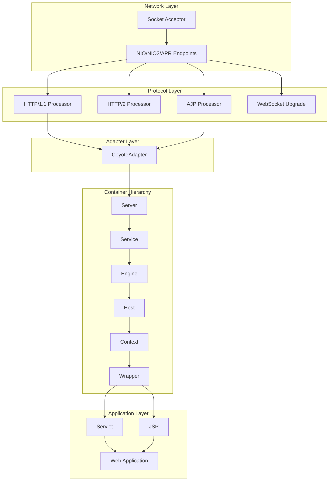

# Apache Tomcat Architecture Overview

## System Design Philosophy

Apache Tomcat follows a **modular monolith** architecture with component-based design principles. The system is built around the concept of **containers** that nest hierarchically and **connectors** that handle different protocols.

## High-Level Architecture



## Core Architectural Principles

### 1. Container-Component Pattern
Every major component implements the `Container` interface and can contain child containers, forming a tree structure:

```
Server (Bootstrap)
└── Service (Groups connectors with engine)
    ├── Connector (Protocol handler)
    └── Engine (Request routing)
        └── Host (Virtual host)
            └── Context (Web application)
                └── Wrapper (Servlet)
```

### 2. Pipeline-Valve Pattern
Each container has a processing pipeline with interceptors (valves):

```java
// Request flows through valve chain
request → EngineValve → HostValve → ContextValve → WrapperValve → Servlet
```

### 3. Lifecycle Management
All components follow a strict lifecycle pattern:
```
NEW → INITIALIZING → INITIALIZED → STARTING → STARTED → STOPPING → STOPPED → DESTROYING → DESTROYED
```

### 4. Event-Driven Architecture
Components communicate through lifecycle events and container events, enabling loose coupling.

## Layer Responsibilities

### Network Layer (`org.apache.tomcat.util.net`)
- **Purpose**: Handle raw socket I/O operations
- **Key Components**: 
  - `NioEndpoint` - Non-blocking I/O using java.nio
  - `Nio2Endpoint` - Asynchronous I/O using java.nio2
  - `AprEndpoint` - Apache Portable Runtime native I/O
- **Responsibilities**:
  - Accept incoming connections
  - Manage socket lifecycle
  - Handle SSL/TLS termination
  - Thread pool management for I/O operations

### Protocol Layer (`org.apache.coyote`)
- **Purpose**: Parse and handle different protocols
- **Key Components**:
  - `Http11Processor` - HTTP/1.1 protocol implementation
  - `Http2UpgradeHandler` - HTTP/2 protocol support
  - `AjpProcessor` - Apache JServ Protocol for reverse proxies
- **Responsibilities**:
  - Parse protocol-specific requests
  - Generate protocol-specific responses
  - Handle protocol upgrades (WebSocket, HTTP/2)
  - Manage protocol-specific features (chunking, compression)

### Adapter Layer (`org.apache.catalina.connector`)
- **Purpose**: Bridge between protocol layer and servlet container
- **Key Component**: `CoyoteAdapter`
- **Responsibilities**:
  - Convert protocol-specific requests to servlet API requests
  - Map requests to appropriate containers
  - Handle character encoding
  - Manage request/response recycling

### Container Layer (`org.apache.catalina.core`)
- **Purpose**: Implement servlet container hierarchy
- **Key Components**:
  - `StandardServer` - Top-level server instance
  - `StandardService` - Groups connectors with engine
  - `StandardEngine` - Routes requests to virtual hosts
  - `StandardHost` - Manages virtual hosts
  - `StandardContext` - Web application container
  - `StandardWrapper` - Individual servlet wrapper
- **Responsibilities**:
  - Request routing and dispatch
  - Security enforcement
  - Session management
  - Resource management
  - Valve pipeline processing

## Key Subsystems

### 1. Request Processing Pipeline

```
┌─────────────┐    ┌──────────────┐    ┌─────────────┐    ┌──────────────┐
│   Socket    │───→│   Protocol   │───→│   Adapter   │───→│  Container   │
│  (Network)  │    │  (Parsing)   │    │  (Bridge)   │    │  (Pipeline)  │
└─────────────┘    └──────────────┘    └─────────────┘    └──────────────┘
       │                   │                   │                   │
       ▼                   ▼                   ▼                   ▼
  NioEndpoint        Http11Processor      CoyoteAdapter      Valve Chain
```

### 2. Classloading Architecture

```
Bootstrap ClassLoader (JRE classes)
    │
System ClassLoader (Tomcat core)
    │
Common ClassLoader (shared libraries)
    │
WebApp ClassLoader (per-application)
```

**Delegation Model**: Child-first for web application classes, parent-first for system classes.

### 3. Session Management Architecture

```
Session Manager
├── Standard Manager (in-memory)
├── Persistent Manager (file/database)
└── Cluster Manager (distributed)
    └── DeltaManager (session replication)
        └── Tribes (group communication)
```

### 4. Security Architecture

```
Request → Authentication → Authorization → Resource Access
   │            │              │              │
   ▼            ▼              ▼              ▼
Security   Authenticator   Security      Protected
Filter        Valve       Constraint    Resource
```

## Performance Characteristics

### Threading Model
- **Connector Threads**: Handle I/O operations (configurable pool)
- **Application Threads**: Execute servlet code (container managed)
- **Background Threads**: Periodic maintenance tasks
- **Async Threads**: Handle async servlet operations

### Memory Management
- **Request Objects**: Recycled between requests
- **Buffer Management**: Pooled ByteBuffers for I/O
- **Session Storage**: Configurable storage backends
- **Class Loading**: Isolated per web application

### Scalability Features
- **Non-blocking I/O**: NIO/NIO2 connectors
- **Connection Pooling**: Database and HTTP connections
- **Clustering**: Session replication and failover
- **Caching**: Various levels of caching (static resources, compiled JSPs)

## Extension Points

### 1. Custom Connectors
Implement `ProtocolHandler` interface for new protocols:
```java
public class MyProtocolHandler extends AbstractProtocol<MySocket> {
    // Custom protocol implementation
}
```

### 2. Custom Valves
Extend `ValveBase` for request processing:
```java
public class MyValve extends ValveBase {
    public void invoke(Request request, Response response) {
        // Custom processing
        getNext().invoke(request, response);
    }
}
```

### 3. Custom Realms
Implement `Realm` interface for authentication:
```java
public class MyRealm extends RealmBase {
    protected Principal authenticate(String username, String password) {
        // Custom authentication logic
    }
}
```

### 4. Custom Session Managers
Extend `ManagerBase` for session handling:
```java
public class MyManager extends ManagerBase {
    // Custom session management
}
```

## Configuration Architecture

### XML Configuration Parsing
- **Digester Pattern**: Rules-based XML parsing
- **Reflection-based**: Automatic property setting
- **Validation**: DTD/Schema validation support

### Configuration Hierarchy
```
server.xml (Server configuration)
├── context.xml (Default context settings)
├── web.xml (Servlet mappings)
└── {webapp}/WEB-INF/
    ├── web.xml (Application-specific)
    └── context.xml (Application context)
```

## Deployment Architecture

### Hot Deployment
1. **File Watcher**: Monitors webapps directory
2. **Context Creation**: Creates new Context instance
3. **Class Loading**: Isolated webapp classloader
4. **Startup**: Servlet initialization and startup
5. **Registration**: URL mapping registration

### Clustering Deployment
1. **Node Discovery**: Multicast or static membership
2. **State Replication**: Session and context data
3. **Failover**: Automatic request routing
4. **Load Balancing**: Sticky sessions support

## Monitoring and Management

### JMX Architecture
- **MBean Registration**: Automatic component exposure
- **Hierarchical Naming**: Reflects container structure
- **Runtime Management**: Configuration changes without restart

### Logging Architecture
- **Juli**: Tomcat's logging implementation
- **Per-Context Logging**: Isolated log configurations
- **Async Logging**: High-performance logging option

## Integration Patterns

### Servlet Container Integration
- **Embedded Mode**: Programmatic Tomcat API
- **Standalone Mode**: Traditional deployment
- **Cloud Native**: Container and Kubernetes support

### Reverse Proxy Integration
- **AJP Protocol**: Apache HTTP Server integration
- **Load Balancer**: Session affinity support
- **SSL Termination**: Proxy-aware security headers

This architecture provides a solid foundation for understanding how Tomcat processes requests, manages resources, and can be extended or customized for specific requirements.