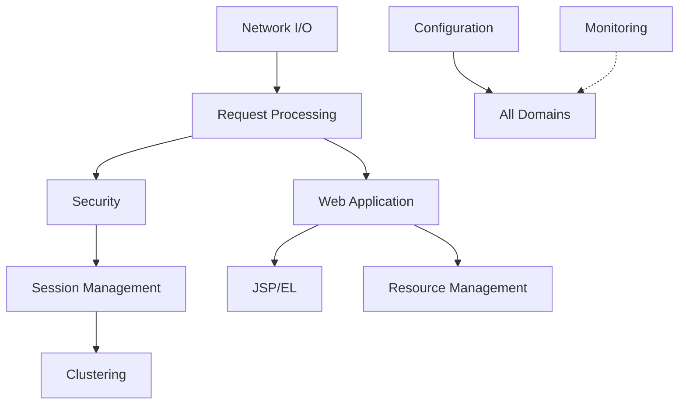

# Apache Tomcat Domain Maps

## Overview
This directory contains domain-specific documentation for Apache Tomcat's major functional areas. Each domain represents a cohesive set of responsibilities within the codebase.

## Domain Structure

### Core Domains

1. **[Request Processing](request-processing.md)** - HTTP request handling pipeline
2. **[Security & Authentication](security.md)** - Security infrastructure  
3. **[Session Management](session-management.md)** - Session lifecycle and replication
4. **[Web Application Deployment](webapp-deployment.md)** - WAR deployment and context management
5. **[Network I/O](network-io.md)** - Connection handling and protocols
6. **[JSP & Expression Language](jsp-el.md)** - JSP compilation and EL evaluation
7. **[Clustering & HA](clustering.md)** - High availability and replication
8. **[Resource Management](resource-management.md)** - JNDI, connection pools, resources
9. **[Configuration & Lifecycle](configuration.md)** - XML parsing, lifecycle management
10. **[Monitoring & Management](monitoring.md)** - JMX, logging, diagnostics

## Navigation Guide

Each domain document includes:
- **Purpose**: What the domain handles
- **Key Components**: Main classes and packages
- **Entry Points**: Where to start exploring
- **Interfaces**: Key abstractions and contracts
- **Dependencies**: What it relies on
- **Dependents**: What relies on it
- **Common Tasks**: Typical operations and modifications
- **Testing**: How to test this domain

## Quick Reference

| Domain | Primary Package | Key Interface | Start Here |
|--------|----------------|---------------|------------|
| Request Processing | `o.a.catalina.connector` | `Request/Response` | `CoyoteAdapter` |
| Security | `o.a.catalina.authenticator` | `Authenticator` | `AuthenticatorBase` |
| Sessions | `o.a.catalina.session` | `Manager` | `StandardManager` |
| Deployment | `o.a.catalina.startup` | `HostConfig` | `ContextConfig` |
| Network I/O | `o.a.coyote` | `ProtocolHandler` | `Http11Processor` |
| JSP/EL | `o.a.jasper` | `JspServlet` | `Compiler` |
| Clustering | `o.a.catalina.tribes` | `Channel` | `GroupChannel` |
| Resources | `o.a.naming` | `NamingContext` | `ResourceFactory` |
| Configuration | `o.a.catalina.startup` | `Digester` | `Catalina` |
| Monitoring | `o.a.catalina.mbeans` | `MBeanFactory` | `Registry` |

## Cross-Domain Interactions

## Domain Complexity Ratings

- ⭐⭐⭐⭐⭐ **Network I/O** - Complex async handling
- ⭐⭐⭐⭐⭐ **Clustering** - Distributed systems complexity
- ⭐⭐⭐⭐ **Request Processing** - Multi-layer pipeline
- ⭐⭐⭐⭐ **Security** - Multiple auth mechanisms
- ⭐⭐⭐ **Session Management** - State management
- ⭐⭐⭐ **JSP/EL** - Compilation pipeline
- ⭐⭐⭐ **Web App Deployment** - Classloader complexity
- ⭐⭐ **Resource Management** - JNDI lookups
- ⭐⭐ **Configuration** - XML parsing
- ⭐⭐ **Monitoring** - JMX exposure